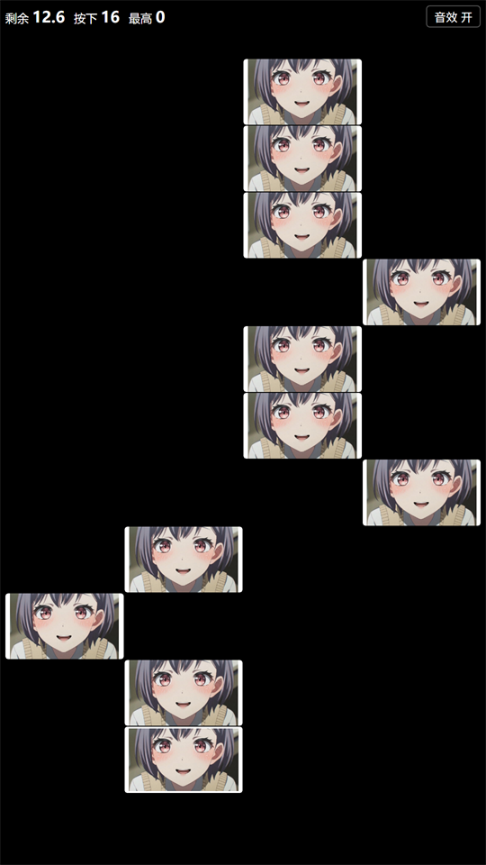

# 新概念音游 · 来吧，走↑起↓（gqk-piano-tiles）

一个**单文件、零依赖、离线可玩**的极简黑白节奏小游戏，用原生 JavaScript 写成。灵感来自"别踩白块 / 钢琴块"，但把规则收紧成一条：**从下往上，只能按最底下那一块**。

可以随意更改图片和音效,只需在同一目录下对应文件名即可

> 整个游戏就是一个 `index.html`，双击即玩，不需要服务器、npm、构建工具或任何第三方库。



## 玩法

- 屏幕是 **12 行 × 4 列** 的棋盘，每行随机出现 **1 个**白色方块。
- **按下第一块才开始计时**，限时 **20 秒**。
- 必须 **由下往上依次按**，且 **只能按最底下那一行**的那一块。
- 踩到以下任一情况立即结束：
  - **越级按** —— 按了最底行以外的任何格子；
  - **按到非钢琴块区域** —— 同一行里点空位（每行只有 1 块是真的）。
- 最高分存在 `localStorage`，关掉浏览器也在。

## 特性

| 特性 | 说明 |
| --- | --- |
| 单文件分发 | 逻辑 / 样式 / 结构全在 `index.html`，无外部依赖、无 CDN |
| 纯随机但不无解 | 每行只有 1 块；同一列最多连出 3 次（`COL_RUN_MAX`），避免手感诡异 |
| 按需生成 | 开局先算 11 行，之后按需补充，永远不空转、不越界 |
| 低延迟输入 | 优先 `pointerdown`，`click` 兜底并用时间戳去重；35ms 防连点 |
| 几何命中判定 | 按触点坐标找出格子，而非依赖事件目标，1~2px 缝隙不会误判 |
| 音频双通道 | 同源走 **Web Audio**（可精确掐断），跨域自动降级到 `<audio>` 媒体通道 |
| 音频地址探测 | 依次尝试 相对路径 → 同协议绝对地址 → 强制 https → 强制 http，第一个能拿到音频的胜出 |
| 图片兜底 | `gqk.png` / `gqk1.png` 解码失败时自动回退为纯色块，照样能玩 |
| 移动端适配 | 紧凑间距、`viewport-fit=cover`、禁用长按菜单与双击缩放 |
| 自检可见 | 页面把音频状态、构建号、脚本错误直接打印在状态条下方，方便排查 |

## 快速开始

**方式一：直接打开**

```
双击 index.html
```

**方式二：本地起个静态服务**（推荐，音效更稳）

```bash
python -m http.server 8000
# 然后访问 http://localhost:8000
```

## 音效配置

游戏按顺序探测音效地址，第一个真正能取到音频的胜出。如果音效放在 CDN / 对象存储，用 URL 参数覆盖即可：

```
index.html?sndbase=https://your.host/audio
```

> 注意：**https 页面只能加载 https 音效**，否则会被浏览器的混合内容规则拦掉。内网穿透（frp 等）场景下，建议直接用穿透的 http 地址访问，或给面板也配上 https。

`audio-test.html` 是一个独立的**音效地址探测小工具**，会逐个测试同一文件的不同协议 / 端口写法并给出可用结论，方便定位混合内容问题。

## 项目结构

```
.
├── index.html        # 游戏本体（结构 + 样式 + 逻辑，单文件）
├── audio-test.html   # 音效地址探测工具
├── gqk.png           # 未按下状态的方块图案
├── gqk1.png          # 已按下状态的方块图案
├── 111.MP3           # 按下音效
└── 222.MP3           # 结束音效
```

## 可调参数

都集中在 `index.html` 顶部的 `/* ======= 参数 ======= */` 区块：

| 参数 | 默认 | 含义 |
| --- | --- | --- |
| `ROWS` | 12 | 棋盘行数 |
| `COLS` | 4 | 棋盘列数 |
| `DURATION` | 20 | 限时（秒） |
| `PRESS_MS` | 35 | 防连点间隔（毫秒） |
| `START_ROWS` | 11 | 开局一次性渲染的行数 |
| `COL_RUN_MAX` | 3 | 同一列最多连续出现次数 |
| `BUILD` | 17 | 构建号，显示在页面上用于确认加载到了最新版 |

## 部署

纯静态，丢哪都能跑：**GitHub Pages、Vercel、Netlify、Nginx、宝塔面板**，或者任意静态托管。仓库根目录就是站点根目录。

## 开源协议

本项目采用**「非商用免费 / 商用需授权」**协议：

- ✅ **个人学习、研究、教学等非商业用途**：免费使用，保留署名即可
- ❌ **任何商业用途**：须事先取得作者书面授权

> 💼 **如需商用，请联系本人：** <https://github.com/123xiaojun>
> 作者：**123xiaojun**

完整条款见 [LICENSE](LICENSE)。
